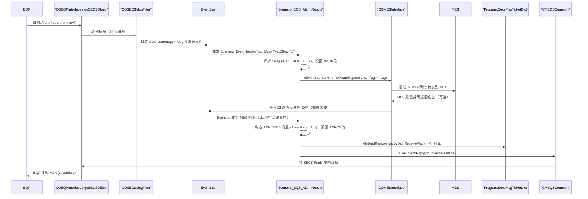
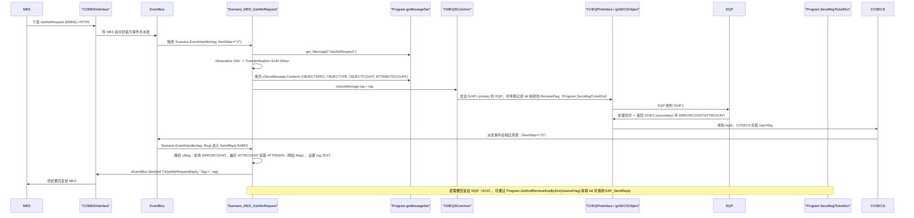

## EAP流程处理

#### 从 EQP 接收到指令的处理流程（以 AlarmReport 为例）

```mermaid
sequenceDiagram
    participant EQP
    participant SECSLayer as "COEQPInterface / goSECSObject"
    participant COSECS as "COSECSMsgFilter"
    participant EventBus
    participant Scenario as "Scenario_EQS_AlarmReport"
    participant COMES as "COMESInterface"
    participant MES
    participant ProgramStorage as "Program.SecsMsgTicketDict"
    participant CMEQS as "CMEQSCommon"

    EQP->>SECSLayer: S5F1 AlarmReport (primary)
    SECSLayer->>COSECS: 收到原始 SECS 消息
    COSECS->>EventBus: 封装 COClosure(tag) + Msg 并发送事件
    EventBus->>Scenario: 触发 Scenario_EventHandler(tag, Msg) (NextStep="1")
    Scenario->>Scenario: 解析 xMsg (ALCD, ALID, ALTX)，设置 tag 字段
    Scenario->>COMES: xEventBus.Send(ref TxAlarmReportSend, "Tag:=", tag)
    COMES->>MES: 通过 MSMQ/网络 转发到 MES
    MES-->>COMES: MES 处理并可返回应答（可选）
    COMES->>EventBus: 将 MES 返回派发回 EAP（如果需要）
    EventBus->>Scenario: Scenario 收到 MES 回复（或超时/错误事件）
    Scenario->>Scenario: 构造 ACK SECS 消息 (AlarmReportAck)，设置 ACKC5 等
    Scenario->>ProgramStorage: GetAndRemoveKeyByDict(ReceiveFlag) -> 得到 tid
    Scenario->>CMEQS: EAP_SendReply(tid, xSecsMessage)
    CMEQS->>SECSLayer: 将 SECS Reply 发回设备
    SECSLayer->>EQP: EQP 接收 ACK (secondary)
```

#### 从 MES 接收到指令并发给 EQP 的处理流程（以 GetAttrRequest：Scenario_MES_GetAttrRequest 为例）

```mermaid
sequenceDiagram
    participant MES
    participant COMES as "COMESInterface"
    participant EventBus
    participant Scenario as "Scenario_MES_GetAttrRequest"
    participant MessageSet as "Program.goMessageSet"
    participant CMEQS as "CMEQSCommon"
    participant SECSLayer as "COEQPInterface / goSECSObject"
    participant EQP
    participant ProgramStorage as "Program.SecsMsgTicketDict"

    MES->>COMES: 下发 GetAttrRequest (MSMQ / HTTP)
    COMES->>EventBus: 将 MES 指令封装为事件并派发
    EventBus->>Scenario: 触发 Scenario.EventHandler(tag, NextStep=\"1\")
    Scenario->>MessageSet: get_Message(\"GetAttrRequest\")
    Scenario->>Scenario: Deserialize XML -> TransferReqDto<S14F1Req>
    Scenario->>MessageSet: 填充 xSecsMessage.Contents (OBJECTSPEC, OBJECTYPE, OBJECTCOUNT, ATTRIBUTECOUNT)
    Scenario->>CMEQS: xSecsMessage.tag = tag; 
    CMEQS->>SECSLayer: 发送 S14F1 primary 到 EQP，并伴随记录 tid 映射到 ReceiveFlag（Program.SecsMsgTicketDict）
    SECSLayer->>EQP: EQP 收到 S14F1
    EQP->>SECSLayer: 处理完毕 -> 返回 S14F2 (secondary) 带 ERRORCOUNT/ATTRCOUNT
    SECSLayer->>COSECS: 收到 reply，COSECS 封装 tag+Msg
    COSECS->>EventBus: 派发事件给相应场景（NextStep=\"2\"）
    EventBus->>Scenario: Scenario.EventHandler(tag, Msg) 进入 SendReplyToMES
    Scenario->>Scenario: 解析 xMsg：检查 ERRORCOUNT，遍历 ATTRCOUNT 获取 ATTRDATA（例如 Map），设置 tag.TEXT
    Scenario->>COMES: xEventBus.Send(ref TxGetAttrRequestReply, "Tag:=", tag)
    COMES->>MES: 将结果回复给 MES
    Note over Scenario, ProgramStorage: 若需要回复给 EQP（ACK），可通过 Program.GetAndRemoveKeyByDict(receiveFlag) 获得 tid 并调用 EAP_SendReply
```

