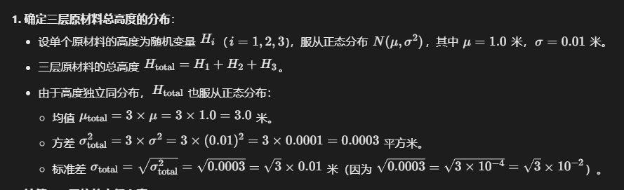
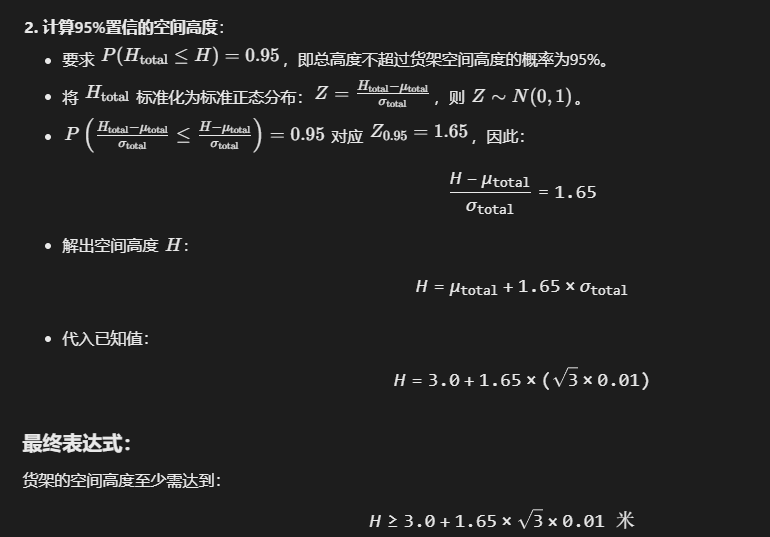

1. 3A检验计算公式

   - **漏报警率**: 定义为标准不合格且检验合格次数 / 标准不合格总次数 × 100%
   - **虚报警率**: 定义为标准合格但检验不合格次数 / 标准合格总次数 × 100%
   - **正确判断能力**: 定义为(标准合格且检验合格次数 + 标准不合格且检验不合格次数) / 总检验次数 × 100%
   - **自身一致性比率**: 定义为三次检验结果一致次数 / 总检验次数 × 100%

   

2. 分析数据的散度：极差、方差、标准差

   分析数据的位置度：均值、中位数、众数

   

3. 完整的CTQ定义  I. 衡量指标 II. 测量方法 III. 目标值 IV. 规格

   

4. ANOVA（方差分析）用于比较三个或更多总体的平均值是否有显著差异，其有效性依赖于几个关键假设。工程师在使用ANOVA前需要注意这些假设是否满足，以确保分析结果的可靠性。

   - **I. 这三个总体的标准差是否没有显著差异**：这对应方差齐性（homogeneity of variances）假设。如果总体的方差不相等（即标准差有显著差异），ANOVA的F检验可能产生偏差，尤其是在样本量不等的情况下。因此，工程师需要检查方差齐性，例如通过Levene's test或Bartlett's test。
   - **II. 这三个总体是否都是正态分布**：这对应正态性（normality）假设。ANOVA要求每个总体的数据近似正态分布，或样本量足够大时中心极限定理适用（样本量通常大于30）。对于小样本，非正态数据可能导致ANOVA结果不准确。工程师可以通过正态性检验（如Shapiro-Wilk test）或直方图/Q-Q图来评估。
   - **III. 来源于每个总体的样本数量是否相等**：样本量相等不是ANOVA的严格假设。ANOVA可以处理不等样本量（不平衡设计），但样本量相等时，ANOVA对方差齐性假设的违反更稳健。然而，样本量不等本身不会使ANOVA无效，因此工程师不需要特别注意这一点，除非其他假设（如方差齐性）存在问题。
   - **IV. 样本来源是否独立**：这对应独立性（independence）假设。样本必须相互独立，即一个样本的值不影响另一个样本的值。如果样本不独立（例如，重复测量或配对数据），ANOVA的结果可能无效。工程师需要确保数据收集方式满足独立性，例如通过随机抽样。

   配对检验需要样本一致

   

5. 假设检验方法选择

   |                 | **Y（因变量）数据类型** |                     →                     |                               |                                           |
   | :-------------: | :---------------------: | :---------------------------------------: | :---------------------------: | ----------------------------------------- |
   | **X（自变量）** |      **分析目标**       |             **Y: 连续型数据**             |       **Y: 连续型数据**       | **Y: 离散型数据**                         |
   |                 |      **统计特征**       |                **平均值**                 |       **方差(标准差)**        | **比率**                                  |
   |  **一个总体**   |                         |               单样本 t 检验               |      单方差（卡方检验）       | 单比率检验                                |
   |  **X: 离散型**  |      **两个总体**       | 双样本 t 检验（独立） 配对 t 检验（相关） |        双方差（F检验）        | 双比率检验                                |
   |                 |      **多个总体**       |           **方差分析（ANOVA）**           | 等方差检验（Bartlett/Levene） | 卡方检验（R×C表） Cochran-Mantel-Haenszel |
   |  **X: 连续型**  |      **多个总体**       |             回归分析 相关分析             |       回归分析 相关分析       |                                           |

   

6. “3A分析”通常指的是“属性一致性分析”（Attribute Agreement Analysis），特别适用于目视检查等属性数据场景。该分析用于评估检查员之间（再现性）和检查员内部（重复性）的一致性，以确保测量系统的可靠性和准确性。

   

7. 方差分析计算

   比较 *k* 个组的均值，每组样本量为 *n*，总样本量 *N*=*k*×*n*

   |   来源   | 平方和 (SS) | 自由度 (df) | 均方 (MS) |    F 值     |
   | :------: | :---------: | :---------: | :-------: | :---------: |
   | **组间** |     SSA     |    *k*−1    |    MSA    | *F*=MSA/MSE |
   | **组内** |     SSE     |   *N*−*k*   |    MSE    |             |
   | **总和** |     SST     |    *N*−1    |     —     |      —      |

   

   

8. **Takt Time = 可用生产时间 / 客户需求数量**

   

9. **IDOV（用于设计新流程或产品，强调从设计阶段确保质量）**

   IDOV 是四个阶段的首字母缩写，具体含义如下：

   1. **I（Identify）—— 识别**
      明确设计目标、客户需求和项目范围。此阶段需收集和分析客户需求（VOC，Voice of the Customer），确定关键质量特性（CTQ，Critical to Quality），并制定项目计划和成功标准。
   2. **D（Design）—— 设计**
      根据识别的需求进行方案设计。通过头脑风暴、流程图、原型设计等方法，提出满足客户需求的设计方案，并考虑潜在风险和可制造性 / 可执行性。
   3. **O（Optimize）—— 优化**
      对设计方案进行优化和验证。利用实验设计（DOE）、模拟分析等工具，测试方案的稳定性和有效性，消除设计中的缺陷，确保方案在各种条件下都能达到预期目标。
   4. **V（Verify）—— 验证**
      确认设计方案是否满足预设目标。通过小规模试点、测试或模拟运行，验证设计的实际效果是否符合客户需求和质量标准，最终确定方案的可行性。

   

10. **DMAIC（用于改进现有流程，解决已知问题）**

    DMAIC 是五个阶段的首字母缩写，是六西格玛中最经典的改进模型，具体含义如下：

    1. **D（Define）—— 定义**
       明确问题、目标和项目边界。此阶段需确定客户需求、流程痛点，定义项目的范围、预期成果和关键绩效指标（KPI），并组建项目团队。

    2. **M（Measure）—— 测量**
       收集并量化现有流程的数据。通过测量关键指标（如缺陷率、周期时间等），了解流程当前的绩效水平（即 “基线”），为后续分析提供数据基础。

    3. **A（Analyze）—— 分析**
       分析数据以找出问题的根本原因。利用统计工具（如鱼骨图、帕累托图、回归分析等），识别影响流程绩效的关键因素，确定导致缺陷或低效率的根源。

    4. **I（Improve）—— 改进**
       制定并实施解决方案。针对分析出的根本原因，设计改进措施（如流程优化、标准化操作等），通过试点验证方案的有效性，并进行调整以确保达到预期效果。

    5. **C（Control）—— 控制**
       巩固改进成果并持续监控。将有效的改进措施标准化，建立监控机制（如控制图），确保流程长期稳定在优化后的水平，防止问题复发，并记录经验教训以便推广。 

       

11. **DPMO（Defects Per Million Opportunities）**

    **定义**：每百万件产品中的不良品数量，反映整体产品合格率。
    ​**​公式​**​：

    $$
    \text{DPMO} = \frac{\text{缺陷总数}}{\text{产品数量} \times \text{单位产品缺陷机会数}} \times 1,000,000
    $$
    
12. **DPPM（Defective Parts Per Million）**

    **定义**：每百万件产品中的不良品数量，反映整体产品合格率。
    ​**​公式​**​：
    $$
    \text{DPPM} = \frac{\text{不良品数量}}{\text{总生产数量}} \times 1,000,000
    $$


13. 宏观流程图组成的五个部分是？I. 输入和输出 II. 流程 III. 供应商 和客户


14. 平衡记分卡由卡普兰（Kaplan）和诺顿（Norton）提出，包含以下四个核心维度：
    1. 财务维度（Financial Perspective）
       - 关注组织的财务目标，如盈利能力、收入增长、成本控制等。
    2. 顾客维度（Customer Perspective）
       - 衡量客户满意度、市场份额、客户留存率等与市场相关的指标。
    3. 内部业务流程维度（Internal Process Perspective）
       - 聚焦关键内部流程的效率与质量，例如生产效率、产品创新、供应链优化等。
    4. 员工学习与成长维度（Learning & Growth Perspective）
       - 评估组织在人力资本、信息系统、组织文化等方面的能力建设，如员工技能提升、技术创新能力等。


15. 正确的备择假设（H₁）应反映其希望验证的目标

    

16. 判定回归模型拟合标准

    1. **ANOVA 显著性**：F-test P-value < 0.05 表示模型整体有意义。

    2. **高 R-squared**：R-Sq 值高（如>70%）表示模型解释大部分变异。

    3. **残差满足假设**：残差随机分布、无模式、近似正态。

       

17. ECRS分析法，是工业工程学中程序分析的四大原则，用于对生产工序进行优化，以减少不必要的工序，达到更高的生产效率。ECRS，**即删除（Eliminate）、合并（Combine）、重排（Rearrange）、简化（Simplify）**

    

18. 为了比较 A 和 B 两个供应商提供的锡浆黏度是否相同，基于随机抽取各 10 个批次的独立样本（即样本间无配对关系），应采用双样本 t 检验（独立样本 t 检验）。该检验需要满足以下假设：

    - **独立性**：样本数据相互独立（问题中“随机抽取”表明独立性可能成立，但仍需验证）。
    - **正态性**：每个样本的数据应来自正态分布（样本量较小，n=10，正态性检验尤为重要）。
    - **方差齐性**：两个总体的方差应相等（等方差），若不相等，需使用 Welch's t 检验（异方差版）。

    **独立性是基础假设，若不满足，t 检验无效。**


19. 




20. 根据6S管理（整理、整顿、清扫、清洁、素养、安全）的定义：
    - **A. 整理是在区分要与不要**：正确。整理（Seiri）的核心是区分必要和不必要的物品，移除不必要的物品，以优化工作空间。
    - **B. 整顿是在做合理的布局**：正确。整顿（Seiton）涉及将必要的物品合理布局，确保易于取用、标识清晰，提高效率。
    - **C. 清洁是在做无死角的清扫**：错误。在6S中，“清洁”（Seiketsu）指的是标准化和维持前三个S（整理、整顿、清扫）的成果，通过制定规则和程序来保持环境整洁。而“无死角的清扫”实际上属于“清扫”（Seiso）的内容，Seiso强调实际清洁工作，如扫除灰尘、垃圾等，不留死角。因此，该选项错误地将“清洁”等同于“清扫”，混淆了两者的概念。
    - **D. 素养是在培养员工的习惯**：正确。素养（Shitsuke）强调培养员工的自律和良好习惯，确保长期遵守6S标准和规则。


20. 在质量成本（Cost of Quality, COQ）框架中，内部损失成本（Internal Failure Costs）是指产品在交付给客户之前，因发现缺陷而产生的成本。这些成本包括返工（rework）、报废（scrap）、重新测试、缺陷分析等，发生在生产或内部检验过程中。

    - **A、产品出货前的检验成本**：这属于**评估成本（Appraisal Costs）**，因为它是为了检测产品或过程是否符合要求而进行的活动（如检验、测试），而不是直接由缺陷引起的损失。
    - **B、售后保修期内的缺陷产品所产生的返修成本**：这属于**外部损失成本（External Failure Costs）**，因为缺陷产品已经交付给客户，成本发生在售后阶段（如保修、退货）。
    - **C、工厂内部缺陷产品返修和报废成本**：这属于**内部损失成本（Internal Failure Costs）**，因为成本源于工厂内部发现的缺陷产品，在出货前进行的返修或报废。
    - **D、机器设备出现故障后的修理成本**：这通常不属于质量成本范畴，而是**设备维护成本**。质量成本聚焦于产品质量问题，而不是生产设备的故障（除非设备故障直接导致产品缺陷，但选项中没有这种关联）。

    - 正确答案是 **C**，因为工厂内部缺陷产品的返修和报废直接对应内部损失成本的定义。

    质量成本的分类可参考标准框架：

    - **预防成本**：预防缺陷（如培训、质量规划）。
    - **评估成本**：检测缺陷（如检验、测试）。
    - **内部损失成本**：内部缺陷处理（如返工、报废）。
    - **外部损失成本**：售后缺陷处理（如保修、退货）。

    

21. **B. 测量阶段主要是测量过程的绩效，即 Y，在测量前要验证测量系统的有效性，找到并确认影响 Y 的关键原因**
    此描述​**​错误​**​。

    - 测量阶段（Measure）的重点是测量过程的输出（Y），验证测量系统的有效性（如通过MSA测量系统分析），以确保数据可靠。
    - 但是，“找到并确认影响 Y 的关键原因” 不属于测量阶段的任务，而是分析阶段（Analyze）的核心活动。测量阶段只是收集和验证Y的数据，而不涉及原因分析或关键原因的识别。

    

22. **1. 力场分析的核心作用：加强说服力（选项B）**

    - 为什么正确？

       力场分析通过视觉化展示方案的驱动力和阻力，提供一个结构化的框架来论证方案的可行性和益处，从而增强其说服力。例如：

      - 在方案评估过程中，团队可以列出所有支持方案的因素（如成本节约、效率提升）和反对因素（如资源不足、员工抵制），然后分析这些力量的相对强弱。
      - 通过强调驱动力如何压倒阻力，或如何通过策略（如减少阻力）来优化方案，决策者可以向利益相关者（如管理层或客户）更有效地“推销”该方案，建立共识和信心。
      - 实际应用场景：在企业变革中，力场分析常用于说服员工接受新方案。例如，展示“市场竞争压力（驱动力）”大于“内部习惯阻力”时，能增强方案的可接受度，使方案更容易被采纳。

    - **关键点**：说服力是力场分析的内在目的——它不仅评估因素，还用于沟通和影响决策，帮助方案在评估中获得支持。

    **2. 其他选项为什么不正确？**

    - **A. 评估解决方案的风险（不准确）**：
      - 力场分析确实涉及识别阻力，这些阻力可能包括风险（如实施风险或操作风险），但它的主要目的不是专门评估风险。风险评估更依赖于工具如风险矩阵或SWOT分析（Strengths, Weaknesses, Opportunities, Threats），这些工具更系统地量化概率和影响。力场分析更侧重力量的平衡（驱动力 vs. 阻力），而非风险本身。因此，A选项过于狭隘，无法涵盖力场分析的核心作用。
    - **C. 制定解决方案实施计划（不准确）**：
      - 力场分析可能间接影响实施计划（例如，通过识别阻力，团队可以制定针对性的缓解策略），但它本身不是直接用于“制定”计划的工具。实施计划需要详细行动步骤、时间表、资源分配等，这通常使用甘特图、项目管理工具或PDCA循环（Plan-Do-Check-Act）。力场分析只是前期评估的一部分，用于识别影响因素，而非规划执行。因此，C选项夸大了其作用。
    - **D. 对比解决方案的优劣势（不准确）**：
      - 力场分析是针对一个特定方案进行深入分析（例如，分析单一变革方案的所有推动和阻碍力量），而不是用于比较多个方案。对比不同方案的优劣势通常使用工具如决策矩阵、成本效益分析或多标准决策分析（MCDA），这些工具能系统性地评分和排名选项。力场分析不涉及横向比较，因此D选项误解了其适用范围。

    

23. 在假设检验中，P<0.05 的通用规则是：**拒绝零假设（H0）**，这意味着有足够的证据支持备择假设（H1）。关键在于每个检验的零假设定义不同，因此需要逐个评估选项的正确性。

    1. **选项I：正态检验（Normality Test）**
       - **零假设（H0）**：数据是正态分布的。
       - **备择假设（H1）**：数据不是正态分布的。
       - **P<0.05的含义**：拒绝H0，表示数据不是正态分布。
       - **结论**：这个说法正确。因为P<0.05拒绝了“数据正态”的假设，所以支持数据非正态。
    2. **选项II：相关分析（Correlation）**
       - **零假设（H0）**：两组数据之间没有相关性（相关系数为0，即独立）。
       - **备择假设（H1）**：两组数据之间存在相关性（相关系数不为0）。
       - **P<0.05的含义**：拒绝H0，表示数据之间存在统计显著的相关性（即不独立）。
       - **结论**：这个说法错误。因为P<0.05时，我们拒绝“没有相关（独立）”的假设，所以实际上数据是相关的，而不是独立的。选项II的表述（“则两组数据之间是独立的”）与P<0.05的实际含义相反。
    3. **选项III：方差分析（ANOVA）**
       - **零假设（H0）**：所有组数据的平均值相等（无区别）。
       - **备择假设（H1）**：至少有一个组数据的平均值与其他组不同（有区别）。
       - **P<0.05的含义**：拒绝H0，表示不同组数据的平均值存在显著差异。
       - **结论**：这个说法正确。P<0.05支持组间平均值有区别。
    4. **选项IV：等方差检验（Equal Variances Test）**
       - **零假设（H0）**：两组数据或多组数据的方差相等。
       - **备择假设（H1）**：方差不等（有区别）。
       - **P<0.05的含义**：拒绝H0，表示方差存在显著差异。
       - **结论**：这个说法正确。P<0.05支持方差不相等。

    

24. 问题描述了一个六西格玛团队使用均值-极差控制图（X-bar and R chart）监控注塑机零件关键尺寸的过程。在优化了注塑模温和压力后，均值控制图上出现连续15个点落在中心线±1σ内（即C区）。C区是控制图中介于中心线±1σ的区域（A区：±2σ至±3σ，B区：±1σ至±2σ，C区：中心线±1σ）。

    此现象需要根据控制图的判异准则进行解释。控制图的判异准则（如Western Electric规则或Nelson规则）包括多种模式，用于检测过程是否受控或发生异常变化。其中：

    - **准则4（针对异常模式）**：连续15个点落在中心线两侧的C区内，表示过程变异（方差）显著减少。这是一种“好”的异常信号，表明过程变得更加稳定和一致，而非过程失控。
    - 原因：当过程变异减小时，数据点更紧密地围绕中心线分布，落在C区内的概率增加。连续15点在C区表明该模式不是随机波动，而是过程能力改善的证据。

    现在，分析每个选项的正确性：

    - **A、按照控制图判异准则，过程失控，参数优化失败**
      ​**​错误​**​：判异准则中的“连续15点在C区”确实是一种异常信号，但它表示过程变异减小（改进），而非过程失控。过程失控通常指均值偏移、变异增大或数据点超出控制限等负面变化。此处优化后变异减小，表明优化可能成功，而非失败。
    - **B、过程均值发生了显著变化**
      ​**​错误​**​：如果过程均值发生显著变化（如偏移），数据点会集中在中心线一侧或向控制限偏移（如连续点在一侧或出界）。但此处所有点都在中心线附近的C区内，表明均值稳定、无偏移，且更接近目标值。
    - **C、过程方差显著增大，需要重新计算控制限**
      ​**​错误​**​：过程方差（变异）增大时，数据点更分散，可能超出控制限或更多落在A区或B区。但此现象是点集中在C区，表明方差减小（变异减少），而非增大。因此，C选项完全相反。
    - **D、过程方差显著减少，需要重新计算控制限**
      ​**​正确​**​：连续15点在C区符合判异准则4，明确表示过程方差显著减少（变异减小），这是优化模温和压力后的积极结果。同时，由于过程变异减小，原始控制限（基于优化前的方差计算）已不再适用，需要重新计算控制限以反映改进后的过程状态。否则，控制图无法有效监控新过程，可能遗漏真正的异常。


25. **相关性分析结果**：

    - **Pearson相关系数 = -0.964**：该值非常接近-1（-1表示完美的负相关），说明Y与X之间存在很强的线性负相关性。
    - **P值 = 0.000**：该值远小于常见的显著性水平（如0.05），表明这种负相关关系在统计上高度显著（即，不太可能随机产生）

    相关分析不能自动推断因果（如X是否影响Y），这需要进一步研究（如回归分析或实验设计）

    

26. SIGMA - σ（标准差）是统计学中衡量数据分布的离散程度的指标，表示数据点相对于平均值的偏离程度或变异性。具体分析如下：

    - **选项分析**：
      - **A: 衡量数据或流程符合客户要求的程度**：这描述的是六西格玛（Six Sigma）中的σ水平概念，σ水平用于度量流程能力与客户要求的符合程度，但σ本身并不直接衡量“符合程度”，而是作为计算基础。在基本定义中，σ不是针对客户要求的指标。
      - **B: 衡量数据的中心趋向度**：中心趋向度由均值、中位数等指标衡量，σ衡量的是离散程度，与中心趋向度无关。
      - **C: 衡量数据或流程不符合客户要求的程度**：同样，这关联六西格玛中的缺陷率概念，但σ本身并非直接衡量“不符合程度”。σ水平高表示缺陷率低（不符合程度低），但σ符号的核心定义不涉及客户要求。
      - **D: 衡量数据分布的离散程度**：这是σ的标准定义，σ（标准差）量化数据点偏离平均值的幅度，值越大表示数据越分散，值越小表示数据越集中。
    - **结论**：σ作为标准差，是统计学基础概念，主要应用于描述数据分布的离散程度。选项D最直接、确切地回答了σ的定义。虽然六西格玛中使用了σ水平来延伸表示质量能力，但问题中的“SIGMA - σ”更侧重于统计符号本身，而非特定应用。


27. 当工程师使用2-Sample t检验来分析丝印参数调整前后锡膏厚度是否有显著差异时，需要考虑以下内容，以确保检验的有效性和结果的可靠性：

    - **I. 需要收集的样本数量**：样本数量直接影响检验的统计功效（即检测出真实差异的能力）。过小的样本可能导致检验功效不足，无法识别实际存在的差异；过大的样本可能过于敏感，检测出不具有实际意义的微小差异。工程师需要在实验设计阶段确定合适的样本大小（例如，基于功效分析），以确保检验的可靠性。
    - **II. 样本数据是否服从正态分布**：2-Sample t检验的核心假设是每个样本的数据应近似服从正态分布。如果样本大小较小（如n < 30），违反正态性可能导致检验结果失真；样本大小较大时（如n > 30），中心极限定理使t检验对正态性假设更稳健，但仍建议检查正态性（如通过正态性检验或可视化方法）。如果数据严重偏离正态，可能需要使用非参数替代方法（如Mann-Whitney U检验）。
    - **III. 显著性差异要求**：工程师需要预先设定显著性水平（通常用α表示，如α=0.05或α=0.01），以定义“统计显著”的门槛。这决定了拒绝零假设（H0）的证据强度。显著性水平的选择取决于实际应用场景（如风险容忍度），错误地选择α可能导致Ⅰ型错误（假阳性）或Ⅱ型错误（假阴性）。
    - **IV. 备择假设的设置**：备择假设（H1）必须根据研究问题明确设置。在2-Sample t检验中，备择假设可以是双尾（例如，H1: μ1 ≠ μ2，用于检测调整前后厚度是否有任何差异）或单尾（例如，H1: μ1 > μ2 或 H1: μ1 < μ2，用于检测厚度是否增加或减少）。设置错误可能导致检验方向偏差，影响结论的准确性。

    以上内容均需考虑，因为：

    - 样本数量（I）是检验设计和功效的基础。
    - 正态性（II）是t检验的关键假设，直接影响检验的适用性。
    - 显著性水平（III）是统计推断的核心标准。
    - 备择假设（IV）定义了检验的具体目标。

    

    28. 根据给定的信息，产品长度服从正态分布，均值 μ = 50 mm，标准差 σ = 0.5 mm，规格下限（LSL）为 48.5 mm，规格上限（USL）为 51.5 mm。不合格品是指长度小于 LSL 或大于 USL 的产品。

        由于分布是正态的，可以通过计算 Z 分数来估计不合格品比例。

        - 对于规格下限（LSL = 48.5 mm）：
          $$
          Z_{\text{LSL}} = \frac{\text{LSL} - \mu}{\sigma} = \frac{48.5 - 50}{0.5} = \frac{-1.5}{0.5} = -3.0
          $$

        - 对于规格上限（USL = 51.5 mm）：
          $$
          Z_{\text{USL}} = \frac{\text{USL} - \mu}{\sigma} = \frac{51.5 - 50}{0.5} = \frac{1.5}{0.5} = 3.0
          $$

        不合格品比例为长度小于 LSL 或大于 USL 的概率，即：

        ```
        P(X<48.5)+P(X>51.5)=P(Z<−3.0)+P(Z>3.0)
        ```

        在标准正态分布中，分布是对称的，因此：

        ```
        P(Z<−3.0)=P(Z>3.0)
        ```

        查标准正态分布表，Z = 3.0 对应的累积概率为 Φ(3.0) = 0.998650，因此：

        ```
        P(Z>3.0)=1−Φ(3.0)=1−0.998650=0.001350
        P(Z<−3.0)=0.001350
        ```

        总不合格概率为：

        ```
        P(Z<−3.0)+P(Z>3.0)=0.001350+0.001350=0.002700
        ```

        转换为百分比：

        ```
        0.002700×100%=0.2700%≈0.27%
        ```

        因此，不合格品比例估计为 0.27%。

        

        **1.65对应95%置信水平，2.00是95.45%，3.00是99.73%**

        

    29. 在六西格玛背景下，分析连续型参数的平均水平通常涉及估计或检验。

        - 置信水平（I）和离散程度（II）是任何样本量计算的必备因素。
        - 显著性差异（III）在假设检验场景中是相关的（例如，检测平均值的最小变化），符合六西格玛问题解决中常见的检验需求。
        - 规格上下限（IV）不直接用于平均值分析，因此被排除。规格上下限（如LSL和USL）用于定义过程能力指数（如Cp、Cpk），但并不直接影响平均值估计的样本量计算。样本量公式（如置信区间或假设检验）不包含规格限，规格限更适用于过程能力分析而非平均值推断。

        

    30. 对于一个稳定且服从正态分布的生产过程，已知 \( C_p = 0.9 \) 和 \( C_{pk} = 0.87 \)。通过分析这两个指数的关系，可以得出以下结论：
        1. **\( Cp \) 的意义**： 
           反映过程标准差与规格范围的匹配程度。\( Cp = 0.9 \) 表明过程能力不足（通常要求 \( Cp ＞1.33 \)），说明标准差较大或规格范围过窄。由于题目未提及规格范围变化，可推断标准差过大是主要原因。
        2. **\( C_pk \) 的意义**： 
           反映均值（\(\mu\)）偏离规格中心的影响。当 \( C_{pk} \) 接近 \( C_p \) 时，说明均值偏移较小。此处 \( C_{pk} = 0.87 \)，略小于 \( C_p = 0.9 \)，表明均值有一定偏移，但偏移量不大（计算得偏移量约为 \( 0.09\sigma \)，对过程能力影响有限）。

        

    31. 在快速换线（SMED）方法中，核心目标是通过减少设备停机时间来提高生产效率，特别是通过区分内部作业（必须在停机时进行）和外部作业（可以在设备运行时进行），并将内部作业转化为外部作业、减少内部作业时间、标准化作业流程等。以下是对选项的分析，以确定哪个不属于快速换线流程：

        - **A: 无序作业变成标准化作业并识别换线内外部作业时间**
          这是SMED的第一步：将混乱的作业流程标准化，并识别内部和外部作业时间，是快速换线流程的核心部分，目的是为后续优化奠定基础。
        - **B: 不减少外部作业时间**
          快速换线流程的重点是减少内部作业时间（影响停机时间），而外部作业时间通常不直接影响设备停机（可以在生产时进行），因此​**​不需要主动减少外部作业时间​**​。但该选项描述的是一种“不作为”或“状态”，并非快速换线流程的积极步骤或原则。相反，SMED流程专注于减少内部作业时间和优化作业转换，而“不减少外部作业时间”只能算作一个隐含结果，不是流程的一部分。
        - **C: 减少内部作业时间**
          这是SMED的核心目标：通过简化、标准化或使用工具减少内部作业时间，以缩短换线停机时间，属于快速换线流程的关键步骤。
        - **D: 设计通用设备**
          这是SMED的常用技术，例如设计通用夹具或快速连接器，以减少换线时的调整时间，是快速换线流程的优化方法之一。

        

    32. **测试设备波动与检验员操作方法的比较（来自不包含交互作用的双因子方差分析表和%研究变异表）**：

        - 在GRR分析中，测试设备本身波动对应“重复性”（Repeatability），检验员操作方法对应“再现性”（Reproducibility，即操作员影响）。
        - 图片中的%研究变异表显示：
          - 重复性（测试设备本身波动）%SV = 23.98%。
          - 再现性（操作员影响）%SV = 13.45%。
          - 重复性%SV（23.98%） > 再现性%SV（13.45%），表明测试设备本身波动的影响比检验员操作方法的影响更大。

    
