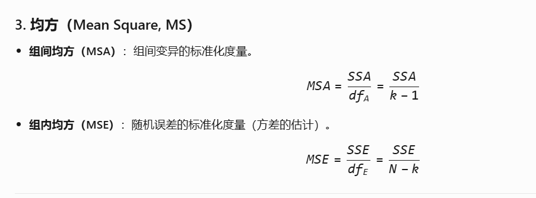

## 绿带精益6σ考题笔记

1. 3A检验计算公式

   - **漏报警率**: 定义为标准不合格且检验合格次数 / 标准不合格总次数 × 100%
   - **虚报警率**: 定义为标准合格但检验不合格次数 / 标准合格总次数 × 100%
   - **正确判断能力**: 定义为(标准合格且检验合格次数 + 标准不合格且检验不合格次数) / 总检验次数 × 100%
   - **自身一致性比率**: 定义为三次检验结果一致次数 / 总检验次数 × 100%

   

2. 分析数据的散度：极差、方差、标准差

   分析数据的位置度：均值、中位数、众数

   

3. 完整的CTQ定义  I. 衡量指标 II. 测量方法 III. 目标值 IV. 规格

   

4. ANOVA（方差分析）用于比较三个或更多总体的平均值是否有显著差异，其有效性依赖于几个关键假设。工程师在使用ANOVA前需要注意这些假设是否满足，以确保分析结果的可靠性。

   - **I. 这三个总体的标准差是否没有显著差异**：这对应方差齐性（homogeneity of variances）假设。如果总体的方差不相等（即标准差有显著差异），ANOVA的F检验可能产生偏差，尤其是在样本量不等的情况下。因此，工程师需要检查方差齐性，例如通过Levene's test或Bartlett's test。
   - **II. 这三个总体是否都是正态分布**：这对应正态性（normality）假设。ANOVA要求每个总体的数据近似正态分布，或样本量足够大时中心极限定理适用（样本量通常大于30）。对于小样本，非正态数据可能导致ANOVA结果不准确。工程师可以通过正态性检验（如Shapiro-Wilk test）或直方图/Q-Q图来评估。
   - **III. 来源于每个总体的样本数量是否相等**：样本量相等不是ANOVA的严格假设。ANOVA可以处理不等样本量（不平衡设计），但样本量相等时，ANOVA对方差齐性假设的违反更稳健。然而，样本量不等本身不会使ANOVA无效，因此工程师不需要特别注意这一点，除非其他假设（如方差齐性）存在问题。
   - **IV. 样本来源是否独立**：这对应独立性（independence）假设。样本必须相互独立，即一个样本的值不影响另一个样本的值。如果样本不独立（例如，重复测量或配对数据），ANOVA的结果可能无效。工程师需要确保数据收集方式满足独立性，例如通过随机抽样。

   配对检验需要样本一致

   

5. 假设检验方法选择

   |                 | **Y（因变量）数据类型** |                     →                     |                               |                                           |
   | :-------------: | :---------------------: | :---------------------------------------: | :---------------------------: | ----------------------------------------- |
   | **X（自变量）** |      **分析目标**       |             **Y: 连续型数据**             |       **Y: 连续型数据**       | **Y: 离散型数据**                         |
   |                 |      **统计特征**       |                **平均值**                 |       **方差(标准差)**        | **比率**                                  |
   |  **一个总体**   |                         |               单样本 t 检验               |      单方差（卡方检验）       | 单比率检验                                |
   |  **X: 离散型**  |      **两个总体**       | 双样本 t 检验（独立） 配对 t 检验（相关） |        双方差（F检验）        | 双比率检验                                |
   |                 |      **多个总体**       |           **方差分析（ANOVA）**           | 等方差检验（Bartlett/Levene） | 卡方检验（R×C表） Cochran-Mantel-Haenszel |
   |  **X: 连续型**  |      **多个总体**       |             回归分析 相关分析             |       回归分析 相关分析       |                                           |

   

6. “3A分析”通常指的是“属性一致性分析”（Attribute Agreement Analysis），特别适用于目视检查等属性数据场景。该分析用于评估检查员之间（再现性）和检查员内部（重复性）的一致性，以确保测量系统的可靠性和准确性。

   

7. 方差分析计算

   比较 *k* 个组的均值，每组样本量为 *n*，总样本量 *N*=*k*×*n*

   |   来源   | 平方和 (SS) | 自由度 (df) | 均方 (MS) |    F 值     |
   | :------: | :---------: | :---------: | :-------: | :---------: |
   | **组间** |     SSA     |    *k*−1    |    MSA    | *F*=MSA/MSE |
   | **组内** |     SSE     |   *N*−*k*   |    MSE    |             |
   | **总和** |     SST     |    *N*−1    |     —     |      —      |

   

   

8. 

9. 

   

