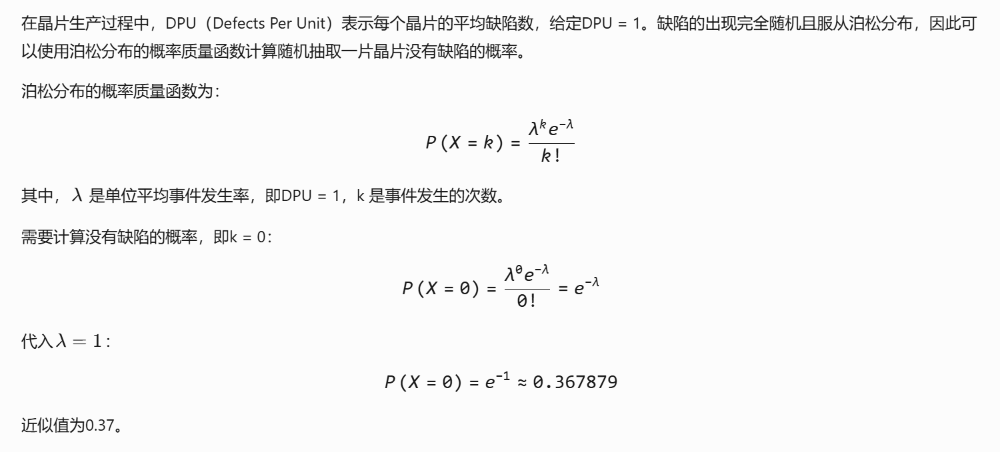

1. 虽然一些参数检验（如t检验、ANOVA）假设数据来自正态分布，但并非所有假设检验工具都要求正态性检验：
   非参数检验（如卡方检验、Mann-Whitney U检验、Kruskal-Wallis检验）不要求数据正态分布，它们适用于非正态或分类数据。
   对于大样本数据（n > 30），中心极限定理允许某些检验（如t检验）近似正态，而不需要严格的正态分布检验。
   其他检验（如比例检验）专门用于离散数据，也无需正态分布检验。
   在实践中，正态分布检验（如Shapiro-Wilk或Anderson-Darling检验）仅在特定参数检验前推荐，但非强制或普适要求。因此，该选项过于绝对，不符合统计原理。

   

2. 直方图只能展示某一时间段内数据的静态分布，无法反映数据随时间的变化趋势。判断过程是否受控（稳定性）需使用控制图

   

3. 过程FMEA的核心是工艺失效，即生产过程中某个步骤可能失败的形式（如漏焊、尺寸超差、装配错误等），这些失效模式直接源于工艺未达成目标

   

4. "规避"一词不准确：重复试验无法完全规避（即避免或消除）试验单元固有的差异，而是通过多次观测减小随机误差的影响，提高结果稳定性。
   混淆"控制"与"规避"：
   真正用于规避单元差异的方法是区组化设计（Blocking）（如将相似单元分组），而非单纯重复。
   重复的核心目的是估计试验误差（通过组内变异），并提高统计检验的灵敏度，而非直接解决单元差异问题。

   

5. 专门用于比较两个独立组之间的比例（或比率）是否有显著差异（例如，合格率、成功率）。它直接处理二分类数据，基于二项分布或正态近似计算，适用于本例场景。

   

6.  评估和选择解决方案的工具有？ I. 力场分析 II. ECRS III. 成对比较 IV.多次投票 V. 鱼骨图的变形

   

7.  要分析两条线体生产的同样的产品的尺寸差异，箱线图最合适，可同时展示 多组数据分布，包括中位数、四分位数、极值和异常值，直观比较两组差异（如尺寸的中心位置、波动范围）。

   

8. 在六西格玛质量水平中，3.4 ppm（每百万次机会缺陷数）的缺陷率是考虑了过程输出质量特性的分布中心相对于目标值存在1.5σ的偏移。这个偏移是六西格玛方法论中的一个关键假设，旨在反映实际过程中可能出现的长期漂移（如设备磨损、环境变化等），使质量水平更接近现实。

   - 如果没有偏移（即中心与目标值完全重合），六西格玛水平（6σ）的理论缺陷率约为0.002 ppm（或0.002 DPMO），几乎为零，远低于3.4 ppm。

   - 但当分布中心偏移±1.5σ时，规格限（如上限或下限）与偏移后的中心之间的距离从6σ缩短为4.5σ（例如，向上偏移1.5σ时，上限距离为4.5σ，下限距离为7.5σ）。此时，缺陷率主要源于较近一侧（4.5σ），P(Z > 4.5) ≈ 3.4 ppm（标准正态分布下）。

     

9. 滚动合格率（Rolled Throughput Yield, RTY）是指在多阶段生产过程中，每个子过程的首次通过率（First Pass Yield, FPY）的乘积。首次通过率是每个子过程中一次性合格（未报废或返修）的产品数量除以该子过程的投入数量。
   RTY = (920 / 1000) × (790 / 920) × (740 / 790)

   

   

10. | 特征           | 计量型数据 (Variables)              | 计数型数据 (Attributes)                |
    | :------------- | :---------------------------------- | :------------------------------------- |
    | **获取方式**   | 测量具体数值                        | 计数或分类                             |
    | **结果性质**   | 连续的、数值型、可带小数、有单位    | 离散的、整数型（计数）或类别型（分类） |
    | **代表性例子** | 尺寸、重量、时间、温度、浓度、速度  | 不合格品数、缺陷数、事故次数、类型     |
    | **信息量**     | 大（包含程度与变异性信息）          | 小（仅数量或类别信息）                 |
    | **分析方法**   | 均值、标准差、过程能力、t检验、回归 | 比例、缺陷率、p/np/c/u图、卡方检验     |

11. **关键区别：失效模式 vs. 失效效应**

    - 失效模式：是失效的内在或直接表现，关注“如何失效”（例如，“密封圈老化”或“电路短路”）。

    - 失效效应：是失效的后果，包括对客户的影响（例如，“产品漏水”或“功能失效”，导致客户不满）。
      在FMEA标准（如AIAG或SAE J1739）中，B的描述更适用于“失效效应”而非“失效模式”。因此，B选项错误地将客户感知的效应等同于失效模式本身。

      

12. 

13. GRR% < 10%：测量系统可接受（良好），变异小，不影响过程分析。
    10% ≤ GRR% ≤ 30%：测量系统条件接受（或称边际接受）。这意味着系统在某些情况下可能可用，但需要改进（例如，优化测量方法或培训操作员），并评估其对具体过程的影响。
    GRR% > 30%：测量系统不可接受，变异过大，必须改进后才能用于过程控制或数据分析。
    问题询问“条件接受的”结果，对应 10% < GRR% < 30% 的范围。

    

14. 在PFMEA（过程失效模式与效果分析）中，RPN（风险优先数）是严重度（Severity, S）、频度（Occurrence, O）和探测度（Detection, D）的乘积（RPN = S × O × D），用于量化失效模式的风险等级。根据AIAG/VDA等标准，优先处理高严重度（S）的失效模式，因为严重度直接关联失效对客户或安全的影响。即使RPN总分相同，高严重度问题必须优先解决。

    

15. 找关键因子：

    - 找因子：IPO（流程图）、鱼骨图（因果图）、解因图
    - 筛选关键因子：因果矩阵（C&E矩阵）、成对比较、多票制、FMEA

