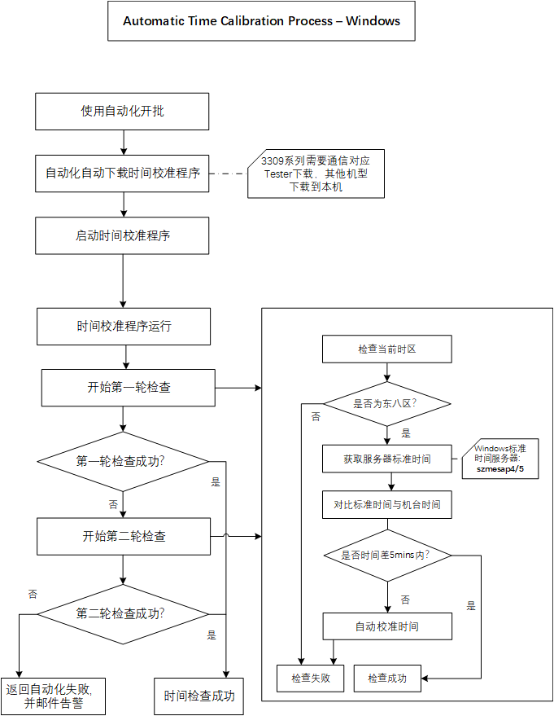
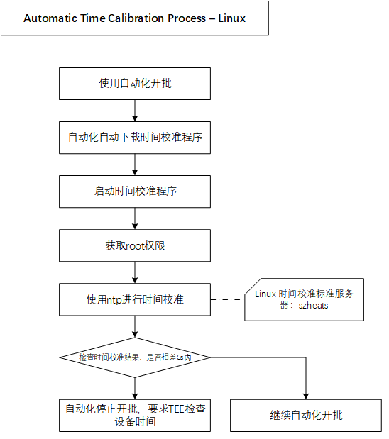

## 自动化时间校准方案

#### 1.时间校准流程

- Windows校准流程





- Linux校准流程

  




#### 2.部署信息

##### 2.1 Windows

- 自动校准程序下载地址：szautoap ； /Common/TimeAlignment
- 程序框架信息：.net framework 2.0
- 权限配置：需具备管理员权限，如果执行报错不具备相应权限，则需添加


##### 2.2 Linux

- 自动校准脚本下载地址：szheats ；/mnt/disk1/disk3/prod/ft/common/ptnmenu_linux/otn
- 权限配置：代码中添加了配置root权限执行


#### 3.自动化代码设计

- Windows

  ```C#
  //使用前添加FTPClient.dll
  
  //实例化使用
  TimeCheck timeCheck = new TimeCheck("172.23.5.34", "BIFtpSys", "bifs@ptnszx01", "/Common/TimeAlignment/", "D:\\TimeAlignment");
  string sResults = timeCheck.CheckTime();
  
  //方法类
  class TimeCheck
  {
      public List<string> prolist   = new List<string>();
      private string sLocalPath;
      private string sPassword;
      private string sPath;
      private string sServerIp;
      private string sUser;
  
      public TimeCheck(string ServerIp, string User, string Password, string Path, string LocalPath )
      {
          this.sServerIp = ServerIp;
          this.sUser = User;
          this.sPassword = Password;
          this.sPath = Path;
          this.sLocalPath = LocalPath;
          prolist.Add("TimeAlignment.exe.config");
          prolist.Add("TimeAlignment.exe");
      }
  
      /// <summary>
      /// 检查时间并返回结果
      /// </summary>
      /// <returns>Y| 表示时间检查成功 ； N|ex 表示检查失败</returns>
      /// <exception cref="Exception"></exception>
      public string CheckTime()
      {
          try
          {
              DownLoad(prolist);
              return CallTimeAlignment();
          }
          catch(Exception e) 
          {
              throw new Exception(e.Message + e.StackTrace);
          }
      }
  
  
      /// <summary>
      /// 自动下载时间检查程序
      /// </summary>
      /// <param name="strings"></param>
      public void DownLoad(List<string> strings)
      {
          FtpClient client = new FtpClient(this.sServerIp, this.sUser, this.sPassword, this.sPath, 5, 0x15);
          client.Login();
          foreach (string s in strings)
          {
              client.Download(s, this.sLocalPath + s, true);
          }
          client.Close();
      }
  
      /// <summary>
      /// 呼叫时间检查程序，启动时间检查并获取结果
      /// </summary>
      /// <returns></returns>
      private string CallTimeAlignment()
      {
          string path = this.sLocalPath + @"\TimeAlignment.exe";
          string fileName = path;
          Process p = new Process();
          p.StartInfo.UseShellExecute = false;
          p.StartInfo.RedirectStandardOutput = true;
          p.StartInfo.FileName = fileName;
          p.StartInfo.CreateNoWindow = true;
          p.Start();
          p.WaitForExit();
          //此处可以返回一个字符串，此例是返回压缩成功之后的一个文件路径
          string output = p.StandardOutput.ReadToEnd();
          return output;
      }
  }
  ```


- Linux

  ```C
  //使用updatetime脚本进行时间校准
  sprintf(sCmd,"updatetime %s %s",stMesLotInfo.hostname, sWorkPath);
  ptn_comm_log_file(PTN_MENU_LOG,"updatetime start.sCmd:[%s]",sCmd);
  iRet = ptn_comm_system(sCmd, sRetVal);
  if(iRet != PTN_MENU_SUCCESS)
  {
      printf( "ERROR [MU000015]:机台时间与服务器相差超过5秒,请联系TEE检查!\n");
      ptn_comm_log_file(PTN_MENU_LOG,"ERROR [MU000015]:机台时间与服务器相差超过5秒,请联系TEE检查!\n");
      return PTN_MENU_ERROR;
  }
  ptn_comm_log_file(PTN_MENU_LOG,"updatetime done");
  ```